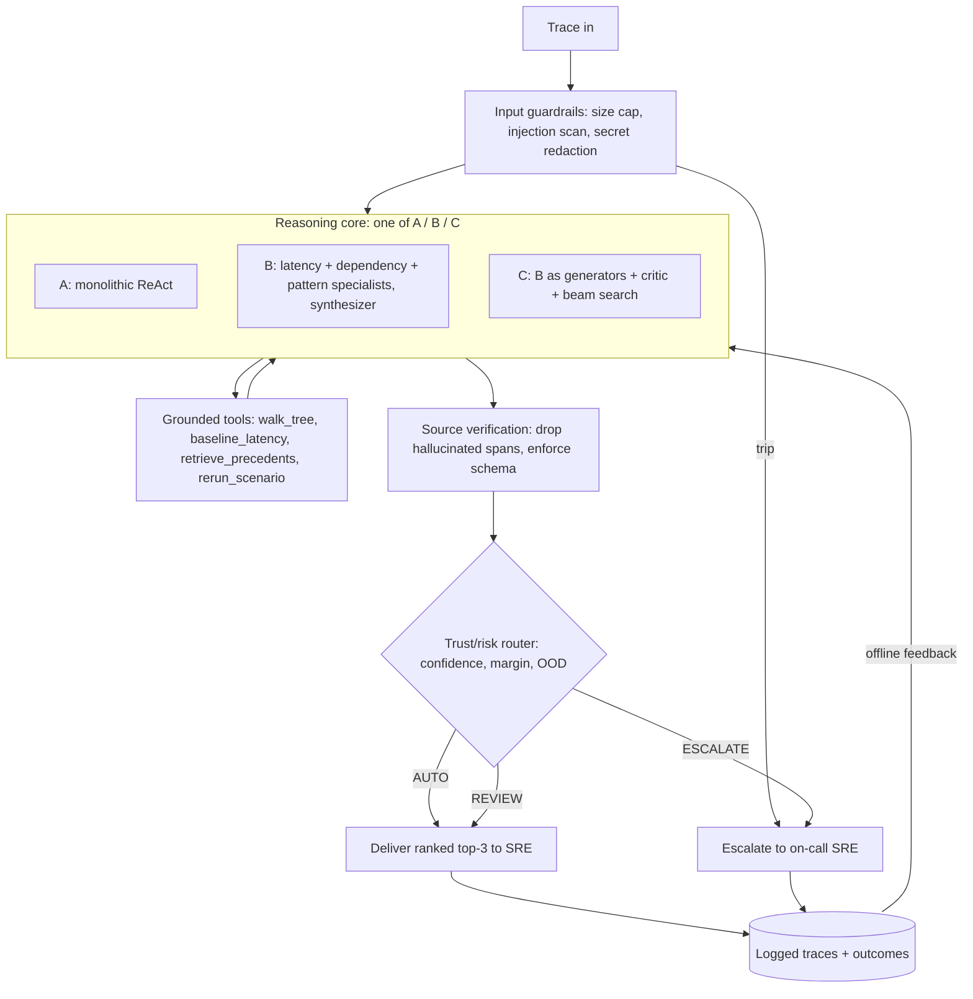
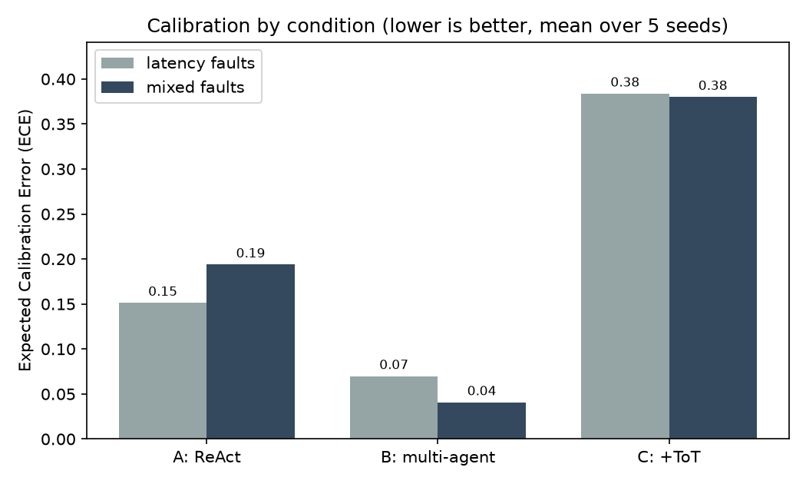
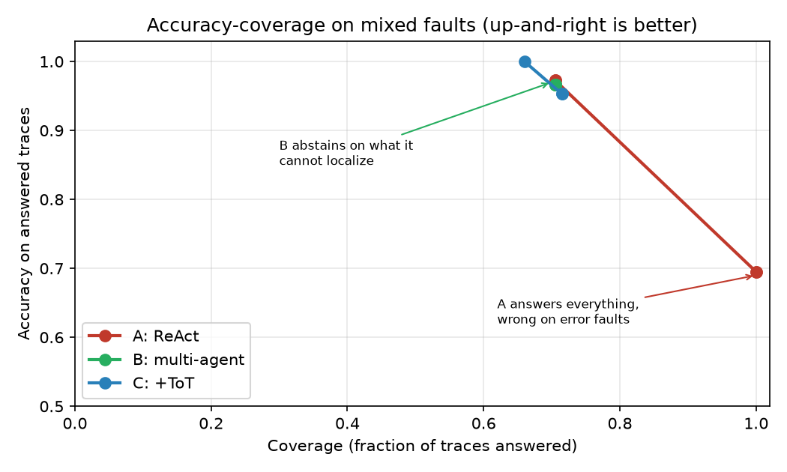

# Capstone Final Report: Trace-Reasoner

Diwanshu Jain · Research Assistant track · Project: Trace-Reasoner

## 1. Project title

**Trace-Reasoner: a calibrated multi-agent assistant for distributed-trace root-cause localization.**

## 2. Problem and user

When a microservice application breaks, the first artifact an on-call engineer reaches for is a distributed trace: the structured record of one user request as it fans out across services. A single checkout trace can carry 200 or more spans across 20 or more services. The slow span at the top is rarely the culprit. It is usually blocked on a child, which is blocked on its own child, where the real bottleneck lives.

The intended user is the on-call SRE who has just been paged at 2am for a latency or error alert and has a stack of candidate traces to read. The problem matters because reading flamegraphs by hand is a large, measurable slice of mean-time-to-resolution (MTTR), the headline reliability metric every observability org tracks. Trace-Reasoner does not replace the engineer. It hands them a short ranked set of root-cause hypotheses with the suspect path highlighted, an evidence trail, and a calibrated confidence score, or it says "inconclusive within budget" and steps aside. I work in observability on a log-aggregation platform, so this is a problem I see from the inside.

## 3. System goal and scope

**Goal.** Given one trace, return a ranked top-3 of candidate culprit spans, each with calibrated confidence and an evidence trail, or return an honest abstention when the evidence does not support an answer.

**What success looks like.** The system clears the naive baseline on localization accuracy by a wide margin, and (the property I care about more) its confidence is calibrated: when it says 0.8, it is right about 80 percent of the time. The commitment I made in Checkpoint 1 is that calibration is graded ahead of raw accuracy, because an SRE who learns to trust a tool that is confidently wrong half the time is worse off than one who kept reading flamegraphs by hand.

**Scope and constraints, deliberately drawn.**

- **Advisory only.** The agent diagnoses; it never remediates. There is no production write path. This bounds the worst-case harm to misdirection rather than an outage.
- **One trace per run.** The unit of work is a single trace, not a fleet-wide correlation problem. That keeps the task well-posed and the evaluation labelable.
- **Iso-token budget.** The whole project is built around one controlled experiment (Section 4), so total tool calls is a controlled variable. Every architectural choice has to pay for itself inside a fixed compute envelope.
- **Public data only.** I deliberately use public datasets (synthetic injected-fault traces and the Nezha FSE'23 benchmark) so a reviewer can rerun the project end to end.

## 4. Final system architecture

The system is one pipeline with three swappable reasoning cores (the experimental conditions) and one safety control system wrapped around whichever core is running.

The spine is a single abstraction: a **localizer** is any function from a `Trace` to a `Prediction` (a ranked list of hypotheses with confidences). The naive baseline, all three experimental conditions, and the safety wrapper are all localizers, so they all score on one harness against one ruler.

**The three reasoning cores (the central experiment).**

- **Condition A, monolithic ReAct.** One agent, one context, all tools. A constrained ReAct loop where each thought must reference the prior observation, with a fixed step budget and a forced report at the end.
- **Condition B, multi-agent specialists.** Three specialist analysts (latency, dependency, pattern) fan out over the trace in isolated contexts and write structured findings into a shared belief state. A deterministic synthesizer reconciles them into a ranked, calibrated prediction, with a capped, targeted re-dispatch when findings conflict. Coordination is hub-and-spoke: specialists never talk to each other, only to the synthesizer.
- **Condition C, multi-agent plus Tree-of-Thought.** The Condition B specialists become thought generators. A separate critic scores each candidate span on four criteria (anomaly grounding, critical-path coverage, precedent support, verification), and a beam-search controller (width 3, depth at most 4) expands and prunes. A branch is hard-pruned only by a negative tool result, never by a weak early score, so the subtle true cause is never killed before retrieval can reframe it.

**Shared components, used by every core.**

- **Grounded tools:** a span-tree walker, a per-(service, operation) latency baseline lookup, a precedent retriever, and a sandbox scenario rerun. The baseline lookup is the tool that earns the agent its keep: it answers "is this span normally this slow?" from data, not from the model's prior.
- **Retrieval (RAG):** FAISS over BGE-small embeddings of a small corpus of resolved-incident notes and chaos-experiment annotations. Retrieved precedent is advisory: it moves the agent away from the obvious wrong answer, but only verified evidence enters the final ranking.
- **Memory:** a structured short-term belief state threaded across steps and specialists, plus the read-only long-term precedent corpus.
- **Safety control system:** input guardrails, source verification, and a trust/risk router (Section 8), wrapped around any core without touching its task logic.

## 5. Design evolution across the program

Each module pushed the design from a vague idea to a concrete, defended architecture. The throughline is a single failure mode I named in Checkpoint 1 and chased the rest of the way: confident-but-wrong root-cause attribution.

| Module | What changed | Why it improved the system |
|---|---|---|
| 1. Problem framing | Defined the agent, the 2am-SRE user, and the calibration-over-accuracy commitment | Set the success criterion that every later choice is measured against: honest uncertainty beats confident error |
| 2. Agent design | Made the loop concrete: constrained ReAct, a structured belief state, four grounded tools | Tied each component to a specific failure of prompt-only models; the belief state stops the loop re-walking ruled-out subtrees |
| 3. Retrieval | Added semantic RAG (FAISS, BGE-small) next to structural search | Diagnosis is analogy: retrieval moves the agent off the obvious slow leaf toward the real cause, while staying advisory so a lexical match cannot become a confident misattribution |
| 4. Tree-of-Thought | Specified Condition C: beam search over hypotheses, generator split from critic | A linear chain commits to one causal story too early and burns the budget backing out; keeping three hypotheses alive defers commitment until the evidence decides |
| 5. Multi-agent | Specified Condition B: three specialists plus a synthesizer, hub-and-spoke | Separate contexts stop a loud signal in one lens (raw latency) from crowding out a subtle one (a victim span), which a single context cannot guarantee |
| 6. Safety | Wrapped the whole thing in guardrails, calibration metrics, and a trust/risk router | Turned "be honest about uncertainty" from an aspiration into an enforced operating policy: the router abstains on the cases the agent cannot calibrate |

The most important refinement was reframing the project as a **controlled experiment** rather than a single agent. From Checkpoint 4 on, A, B, and C are three conditions at an equal token budget, which makes "did multi-agent decomposition help, and did Tree-of-Thought on top of it help" a measurable question instead of an assertion.

## 6. Implementation overview

The build is a Python package (`trace_reasoner`) with a `uv`-managed virtual environment and a green pytest suite (94 tests, offline, no API key required). The framework choices were made deliberately to protect the iso-token-budget comparison.

| Layer | Tool / framework / model | Role and rationale |
|---|---|---|
| Reasoning cores | Hand-rolled Python loop (A); LangGraph state machine (B and C) | LangGraph gives explicit state and coordination for the specialists. The synthesizer and beam controller stay plain Python so orchestration adds no hidden LLM calls to the token budget. I avoided CrewAI for exactly this reason: its hidden calls would corrupt the iso-budget accounting. |
| Retrieval | LangChain plus FAISS plus BGE-small-en | Apache-2 embedding model that runs on a laptop; FAISS for cosine similarity. Used only for precedent retrieval, kept off the hot reasoning path. |
| LLM backends | One `LLMClient` protocol over three brains | A deterministic heuristic mock (offline default, powers tests and the demo), Claude (`claude-opus-4-8`) for the live runs, and a local open model (Qwen2.5-7B via Ollama, OpenAI-compatible) as a free live backend and a model-capability axis. Any condition runs on any backend with no code change. |
| Tool server | MCP | Exposes the grounded tools to an external client; the demo's front door over the same code the loop uses. |
| Evaluation | Custom harness in `eval/` | Every localizer scores on one ruler: top-k accuracy, F1, Brier, ECE, accuracy-coverage curve, escalation rate. |
| Demo | Streamlit (`app.py`) | Pick a trace, a condition, and a brain, and watch the routing decision. |

The design principle behind the backend abstraction is that the brain is swappable and the ruler is fixed. The same comparison runs offline on the mock for reproducibility, on Claude for the headline live numbers, and on a 7B local model to ask whether the architecture gains survive on a model an order of magnitude smaller.

## 7. Evaluation and results

**How I evaluated.** Every condition is scored by the same harness over the same datasets. The naive **slowest-leaf** localizer ("blame the slowest visible span") is the floor the agent must beat. The primary metric is **calibration (ECE, 10-bin)**, graded ahead of raw top-1 and top-3 RCA accuracy, per the Checkpoint 1 commitment. The accuracy-coverage curve and escalation rate measure the "inconclusive within budget" behavior. I report two datasets (deterministic synthetic traces with free ground-truth labels, and the real Nezha FSE'23 benchmark) and three backends (mock, local 7B, Claude).

**Result 1: the agent clears the naive floor decisively.** Slowest-leaf scores top-1 0.39 on synthetic and 0.25 on real Nezha traces. The agent conditions clear that comfortably (below).

**Result 2: the reproducible offline headline (mock, mean ± sd over 5 seeds, n=40 per run).** This is the fully deterministic table that reproduces on any machine with no API key (`eval_aggregate.py`).

| Condition | top-1 (latency) | top-1 (mixed) | ECE (latency) | ECE (mixed) |
|---|---|---|---|---|
| A. ReAct | 0.995 ± 0.01 | 0.695 ± 0.05 | 0.151 ± 0.003 | 0.194 ± 0.038 |
| B. multi-agent | 0.990 ± 0.01 | 0.680 ± 0.04 | **0.070 ± 0.010** | **0.041 ± 0.021** |
| C. plus ToT | 0.990 ± 0.01 | 0.680 ± 0.04 | 0.384 ± 0.010 | 0.380 ± 0.020 |

The top-1 column needs reading with care, because it hides the result that matters. On pure-latency faults all three conditions are essentially perfect (~0.99). The drop on the mixed set is uniform across conditions because the mock has no error-localization heuristic, so every condition misses the error-fault traces, and a miss scores zero in top-1 whether the agent guessed wrong or honestly abstained. Top-1 cannot tell those two failures apart. That is exactly why calibration is the primary metric, and it is where the conditions separate sharply.

*Expected Calibration Error by condition (lower is better, mean over 5 seeds). The multi-agent core (B) is best-calibrated; Condition C's conservative beam pruning leaves it under-confident, which inflates its ECE.*

**Result 3: the conditions differ by abstention discipline, and that is the Checkpoint 1 thesis demonstrated.** Breaking the mixed set down by what each condition does on the unlocalizable error faults, robustly across all five seeds:

- On latency faults, all three localize perfectly (24 of 24, every seed).
- On error faults, none localize (the mock cannot), but they fail differently. **Condition A guesses anyway**, returning a confident wrong span on every error trace. That is the confident-but-wrong 2am failure mode I have tracked since Checkpoint 1. **Conditions B and C abstain** on those same traces, returning "inconclusive within budget."

The breakdown below (mean over 5 seeds, mixed faults, as a share of all 40 traces per run) makes the split explicit. The three conditions reach identical localization accuracy (68%), but A converts every unlocalizable trace into a confident wrong answer while B and C convert them into honest abstentions.

| Condition | Localized correctly | Honestly abstained | Confidently wrong |
|---|---|---|---|
| A. ReAct | 68% | 0% | **30%** |
| B. multi-agent | 68% | 30% | 2% |
| C. plus ToT | 68% | 28% | 2% |

The accuracy-coverage curve makes the consequence concrete. **Condition B answers about 70% of traces and is right 97% of the time on what it answers**: it defers the rest rather than guess. **Condition A answers everything (100% coverage) and pays for it at 69% accuracy**, wrong on the error cases. Same localization skill, opposite trustworthiness. The multi-agent decomposition buys the discipline to abstain, which is the property the project set out to earn.

*Accuracy-coverage on mixed faults (mean over 5 seeds). B and C sit up-and-left (high accuracy on a deliberately smaller answered set); A's line runs down to the lower-right corner, answering every trace at the cost of accuracy. Up-and-right is better, but the honest operating point is the high-accuracy knee, not full coverage.*

One honest qualification on the confidence scale. All three conditions are currently *under*-confident on the mock, Condition C most of all (mean top-1 confidence around 0.60 against near-perfect accuracy on what it answers). C's high ECE is the size of that gap: its beam controller is deliberately conservative, hard-pruning only on negative tool results, so it understates confidence rather than overstating it. The fix is a post-hoc confidence scaling, not a change to the reasoning. Reported as a strength, this is the safer failure direction: under-confidence over-escalates, which wastes an SRE's time, while over-confidence misdirects them, which is the costlier error.

**Result 4: the live-model run shows architecture moving accuracy (Qwen2.5-7B local, n=10, latency faults).** This is the finding the mock cannot produce, because on a real brain the specialists genuinely diverge instead of converging on one heuristic.

| Condition | top-1 | ECE | escalation |
|---|---|---|---|
| A. ReAct | 0.600 | 0.165 | 0.00 |
| B. multi-agent | 0.900 | **0.014** | 0.10 |
| C. plus ToT | **1.000** | 0.390 | 0.00 |

On a model roughly an order of magnitude smaller than Claude, the architecture gains survive and are visible in raw accuracy: the monolithic agent localizes 6 of 10, the multi-agent decomposition 9 of 10, and the Tree-of-Thought variant all 10. Calibration tracks the mock result, with B the best-calibrated and C under-confident. The sample is small (n=10, a single seed) and the per-condition difference of a few traces should be read as directional rather than precise, but the direction is the one the design predicts and matches the earlier single-trace Claude observation.

**Result 5: under the safety lanes, the accuracy gain holds on mixed faults, and complexity has a cost (Qwen2.5-7B local, n=20, mixed faults, run with `--safe`).** This run adds the hard error faults and wraps every condition in the Checkpoint 6 safety system, so the numbers below are post-router: escalation here is the abstention rate the lanes actually produce on a live model.

| Condition | top-1 | F1 | Brier | ECE | escalation |
|---|---|---|---|---|---|
| A. ReAct | 0.400 | 0.400 | 0.174 | 0.270 | 0.250 |
| B. multi-agent | **0.600** | 0.600 | 0.243 | 0.295 | **0.050** |
| C. plus ToT | 0.550 | 0.550 | 0.087 | 0.397 | 0.450 |

Two things read out of this. First, the architecture advantage on accuracy survives the harder fault mix: both decomposed conditions beat monolithic A on top-1 (B at 0.60 and C at 0.55 against A's 0.40), and B does it while abstaining the least (escalation 0.05). On a live brain, B is the practical winner, the most often right and the most willing to answer.

Second, the cost of complexity shows up plainly. Condition C escalates on nearly half its traces (0.45) and posts the worst ECE in the run (0.40). On a 7B model the Tree-of-Thought beam search appears to over-deliberate: it abstains often and stays poorly calibrated on what it does answer. The extra machinery that helped on a clean latency set (Result 4) does not pay for itself on a small model facing mixed faults. That is a finding worth stating, not hiding.

Both readings carry a sample-size caveat. At n=20 with a 10-bin ECE, the calibration and escalation numbers are noisy, and the calibration ordering from the offline aggregate does not reproduce here: B is no longer the clear ECE winner, and the spread between conditions is within what a 20-trace draw can move. I read this run as live evidence that decomposition moves accuracy and that Tree-of-Thought is not free, and I keep the reproducible calibration claim anchored to the multi-seed offline aggregate (Result 2), which is where the seed-stable ECE separation actually lives.

**Strengths.** Beats the naive baseline by a wide margin on localizable faults; the multi-agent core is well-calibrated (ECE 0.04 to 0.07) and abstains rather than guessing on faults it cannot localize; the whole comparison is reproducible offline.

**Limitations (carried into Section 9).** The mock has no error-localization heuristic, so the offline result demonstrates calibration discipline rather than error-fault accuracy, and the architecture-versus-raw-accuracy claim rests on live runs with small n. On real Nezha traces the mock B and C conditions abstain almost always, because their heuristics were built for synthetic trace shapes, so real data needs a real LLM. Condition C's confidence is poorly scaled and needs post-hoc recalibration; on the small live model under the full fault mix (Result 5) it also abstains too readily, which suggests the beam search is not earning its budget on a weak brain.

## 8. Safety and reliability considerations

The safety design follows a layered pipeline and a "router, not gate" oversight model. The control system (`safety/`) wraps any condition without touching its task logic.

- **Guardrails (before the agent).** Schema-validate and size-cap the trace; treat span names and logs as untrusted data, never as instructions (the prompt-injection surface); redact known secret patterns.
- **Source verification (after the agent).** Every named span must resolve to a real span in the input trace, and every claim must cite a tool result. A hallucinated span is dropped before it can be ranked. Precedents below the similarity floor are reported as "no precedent," never counted as support.
- **Monitoring.** The iso-token budget cap doubles as a runaway guardrail, and every run is logged as its own trace for audit and for the offline feedback loop.
- **Fallback logic.** If nothing clears the confidence floor, the output is "inconclusive within budget," an honest abstention rather than a guess.
- **Human oversight: the trust/risk router.** Instead of asking "has a human approved this?", the router asks "does this output meet the criteria to proceed?" and assigns a lane: **AUTO** (confident, in-distribution, grounded; delivered as-is), **REVIEW** (delivered but flagged for a human), or **ESCALATE** (too risky to answer; abstain and route to the on-call SRE). The risk signals are top-1 confidence against a calibrated floor, the margin to the runner-up, an out-of-distribution score grounded in the latency baseline, and any guardrail trip.

A precise word on the oversight model, because it is easy to overstate. For **remediation**, the human is always the actor: the agent only diagnoses, so there is nothing for it to act on without a person. For **diagnosis**, the default AUTO lane is human-on-the-loop: the system delivers without a human in the path, and the human reviews logged traces after the fact. A human is genuinely in the loop only in the REVIEW lane (a person reads the flagged answer) and on any high-impact or guardrail-trip path (for example a non-sandbox scenario rerun halts for approval regardless of confidence). The trade-off is deliberate: I keep the agent advisory, trading autonomy for oversight, because misdirection is the real cost.

The current operating point produces a full AUTO/REVIEW/ESCALATE spread, but its thresholds are tuned to the mock's confidence distribution. Tuning them against the accuracy-coverage curve on live traces is the open safety task (Section 9).

## 9. Limitations and next steps

**Limitations.**

1. **Architecture-driven accuracy gains rest on small-n live runs.** The deterministic mock cannot separate A, B, and C on accuracy by construction, so the strongest accuracy story comes from live runs that are still small.
2. **Condition C's confidence is poorly scaled, and on a weak model it over-abstains.** Its conservative beam pruning leaves it under-confident on the mock (mean top-1 around 0.60 against near-perfect accuracy on answered traces), so ECE near 0.38 reflects the size of that gap. The scores are not yet trustworthy as probabilities, though under-confidence is the safer error direction. On the live 7B model under mixed faults (Result 5), the same conservatism turns into a near-50 percent escalation rate, so the Tree-of-Thought layer does not pay for its budget on a small brain. Whether C's extra machinery earns its keep on a stronger model (Claude) at a defensible n is an open question, not a settled win.
3. **Router thresholds are mock-tuned.** They give a sensible lane spread on synthetic data, but the live confidence distribution differs and the thresholds are not yet calibrated to it.
4. **The mock does not generalize to real traces.** On Nezha, the mock B and C conditions abstain almost always, which is honest behavior but means the offline reproducible result is synthetic-only.

**Next steps, in priority order.**

1. **Calibrate confidence and tune router thresholds against the live accuracy-coverage curve**, especially for Condition C. This is the single change that most improves trustworthiness.
2. **Scale the live A/B/C runs** on Claude and the local model to a large enough n to put error bars on the architecture-versus-accuracy claim.
3. **Add temperature scaling or isotonic recalibration** as a post-hoc calibration layer on the synthesizer's confidence.
4. **Grow the precedent corpus** from real postmortems so retrieval helps on a wider range of real traces.

## 10. Public GitHub repository

The implementation lives in a public repository with a README that explains the project, problem, architecture, setup steps, and usage; the full `trace_reasoner` package; the synthetic and Nezha dataset loaders; the evaluation scripts (`eval_baseline.py`, `eval_conditions.py`, `eval_aggregate.py`) and their sample output; and a Streamlit demo. The comparison runs offline with no API key, so a reviewer can reproduce the headline table in one command.

**Repository:** https://github.com/diwanshu97/trace-reasoner

Minimum contents, confirmed present in the build:

1. **README** with project, problem, architecture, setup, and usage.
2. **Main code:** the `trace_reasoner` package (cores, tools, RAG, safety, MCP, eval harness).
3. **Sample artifacts:** the A/B/C comparison tables and baseline reports the eval scripts print.
4. **Run instructions:** offline (`pytest`, `eval_conditions.py`, `eval_aggregate.py`) and live (`run_local.py`, `run_multiagent.py`, `run_tot.py`).
